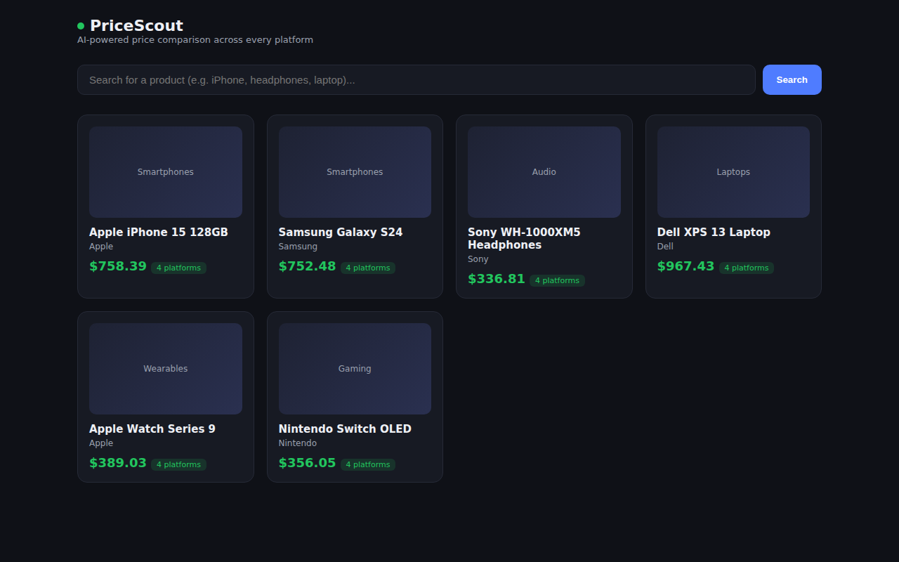
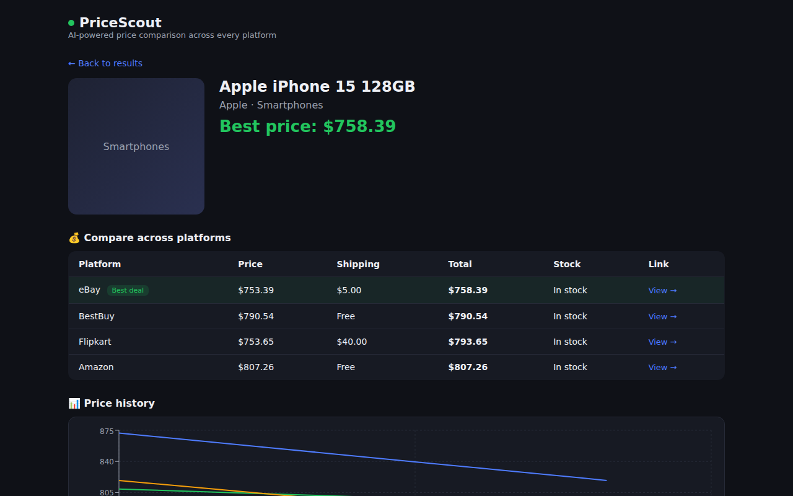
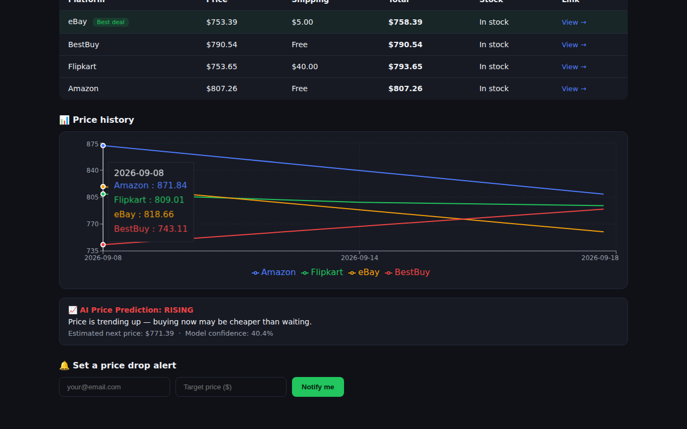
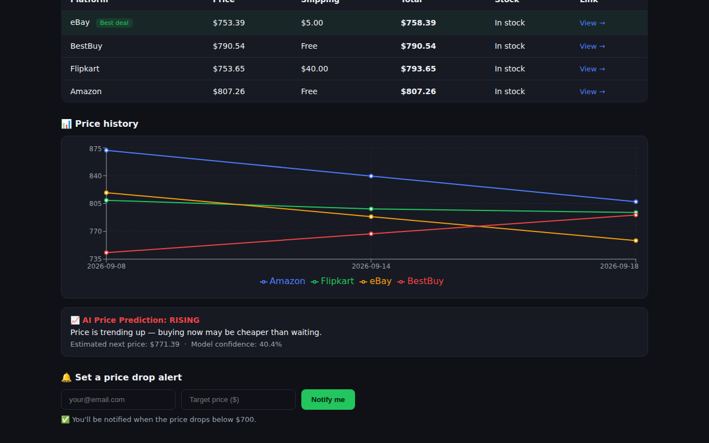
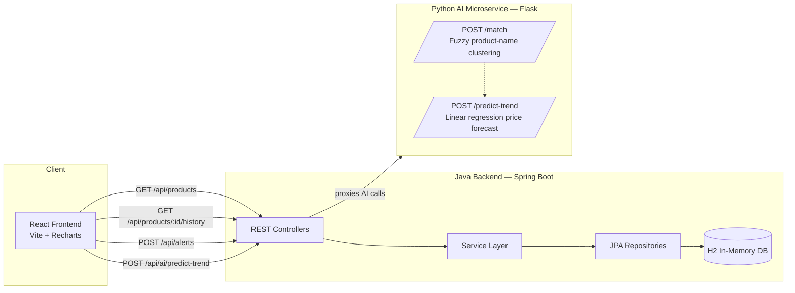

# PriceLens — AI-Powered Cross-Platform Price Comparison

> Find the same product across multiple retailers, see which one is genuinely cheapest after shipping, track price history, and get an AI-generated buy/wait recommendation — all in one place.

A full-stack, microservices-based e-commerce price comparison platform built to demonstrate backend architecture, service-to-service communication, and applied NLP — not just another CRUD app.

    

---

## 📸 Screenshots

| Product search & comparison | Product detail with price history |
|---|---|
|  |  |

| AI price prediction | Price drop alert |
|---|---|
|  |  |

*(These are real captures of the app running with live data — not mockups.)*

---

## 🎥 Demo Video

**[`demo-video.mp4`](demo-video.mp4)** — a ~20s walkthrough: browsing products, searching, opening a product's price comparison, the price-history chart, the AI trend prediction, and setting a price alert. GitHub renders `.mp4` files inline when you open them in the repo.

---

## 💡 About This Project

Shopping for electronics almost always means the same product is listed at different prices — plus different shipping costs — across Amazon, Flipkart, eBay, and other platforms, often under slightly different product titles. **PriceLens** solves this by:

1. **Aggregating** prices for the same product across multiple platforms
2. **Normalizing the true cost** (price + shipping) so "best price" reflects what you'd actually pay
3. **Matching messy product titles** from different sources using NLP-based fuzzy text clustering, so "Apple iPhone 15 128GB Blue" and "iPhone15 128 GB (Blue) - Apple" are recognized as the same product
4. **Predicting price trends** with a lightweight regression model, so users know whether to buy now or wait
5. **Alerting** users by email when a price drops below their target

This was built as a portfolio project to demonstrate:
- Designing and building a **REST API** with Java + Spring Boot
- **Microservice architecture** — a Java backend and a Python AI service communicating over HTTP, each independently runnable and testable
- Applying **NLP techniques** (fuzzy string matching / text clustering) to a real data-quality problem
- Building a clean **React** frontend that consumes multiple backend services
- Writing **maintainable, documented, testable code** — not just "make it work" code

---

## 🏗️ Architecture



**Why two backend services instead of one?** It mirrors how real e-commerce/price-intelligence systems are actually built: the core transactional API (Java/Spring) stays fast and simple, while data-science-heavy work (fuzzy matching, trend prediction) lives in a Python service that can be scaled, redeployed, or swapped for a heavier ML model independently — without touching the main API.

---

## 🧰 Tech Stack

| Layer | Technology | Why |
|---|---|---|
| Backend API | Java 17, Spring Boot 3.3, Spring Data JPA | Industry-standard, strongly typed, huge job-market relevance |
| Database | H2 (in-memory) | Zero-config — clone and run, no DB install required |
| AI Microservice | Python 3, Flask, RapidFuzz, NumPy | Lightweight, fast to iterate, easy to swap in heavier ML later |
| Frontend | React 18, Vite, Recharts | Fast dev experience, resume-relevant, real charting library |
| Communication | REST over HTTP/JSON | Simple, debuggable, framework-agnostic |

---

## ✨ Features

- 🔍 **Search & browse** products by name, brand, or category
- 💵 **True-cost comparison** — price + shipping, sorted lowest to highest, best deal auto-highlighted
- 📈 **Price history chart** per platform (Recharts line chart)
- 🤖 **AI price trend prediction** — "rising / falling / stable" with a confidence score and a plain-English recommendation
- 🧩 **AI product matching** — clusters messy, differently-worded product titles from different platforms into one canonical product (`/api/ai/match`)
- 🔔 **Price drop alerts** — save an email + target price per product
- 🗄️ **Pre-seeded demo data** — 6 products × 4 platforms × 3 historical price points, so the app is fully populated the moment you run it

---

## 📂 Project Structure

```
price-compare-app/
├── backend/                  # Java Spring Boot REST API
│   ├── src/main/java/com/pricecompare/
│   │   ├── controller/       # REST endpoints
│   │   ├── service/          # Business logic + AI service client
│   │   ├── repository/       # Spring Data JPA repositories
│   │   ├── model/             # JPA entities
│   │   └── dto/               # Response DTOs
│   └── src/main/resources/
│       ├── application.properties
│       └── data.sql          # Seed data (auto-loaded on startup)
├── ai-service/                # Python Flask AI microservice
│   ├── app.py                 # Flask routes
│   ├── matching.py            # Fuzzy product-name clustering
│   └── price_predictor.py     # Linear regression trend prediction
├── frontend/                  # React + Vite frontend
│   └── src/
│       ├── components/
│       ├── api.js             # API client
│       └── App.jsx
├── screenshots/                # Add your own screenshots here
└── README.md
```

---

## 🚀 Getting Started

### Prerequisites
- **Java 17+** and **Maven 3.9+**
- **Python 3.10+**
- **Node.js 18+** and npm

### 1. Clone the repo
```bash
git clone https://github.com/<your-username>/price-compare-app.git
cd price-compare-app
```

### 2. Start the AI microservice (port 5001)
```bash
cd ai-service
pip install -r requirements.txt
python app.py
```
Verify it's running: `curl http://localhost:5001/health` → `{"status": "ok", ...}`

### 3. Start the Java backend (port 8080)
```bash
cd backend
mvn spring-boot:run
```
> No database setup needed — H2 runs in-memory and auto-loads seed data from `data.sql` on every startup.

Verify it's running: `curl http://localhost:8080/api/products` → JSON list of 6 seeded products.

Optional: browse the H2 console at `http://localhost:8080/h2-console` (JDBC URL: `jdbc:h2:mem:pricecompare`, user: `sa`, blank password).

### 4. Start the frontend (port 5173)
```bash
cd frontend
npm install
npm run dev
```
Open **http://localhost:5173** in your browser.

---

## 🔌 API Reference

### Java Backend (`http://localhost:8080/api`)

| Method | Endpoint | Description |
|---|---|---|
| GET | `/products` | List all products with price comparisons across platforms |
| GET | `/products/search?query=...` | Search products by name/brand/category |
| GET | `/products/{id}` | Full comparison detail for one product |
| GET | `/products/{id}/history` | Chronological price history (all platforms) |
| POST | `/alerts` | Create a price-drop alert `{ productId, email, targetPrice }` |
| POST | `/ai/match` | Proxy to the AI service's product-matching endpoint |
| POST | `/ai/predict-trend` | Proxy to the AI service's price-trend prediction |

### AI Microservice (`http://localhost:5001`, called directly or via the Java proxy above)

| Method | Endpoint | Description |
|---|---|---|
| GET | `/health` | Liveness check |
| POST | `/match` | `{ "names": ["title1", "title2", ...] }` → clustered product groups |
| POST | `/predict-trend` | `{ "history": [871.84, 839.55, 807.26] }` → trend + predicted next price |

**Example — product matching:**
```bash
curl -X POST http://localhost:5001/match \
  -H "Content-Type: application/json" \
  -d '{"names": ["Apple iPhone 15 128GB Blue", "iPhone15 128 GB (Blue) - Apple", "Samsung Galaxy S24 256GB Black"]}'
```
```json
{
  "cluster_count": 2,
  "clusters": [
    { "canonical_name": "Apple iPhone 15 128GB Blue", "members": [...], "avg_confidence": 94.2 },
    { "canonical_name": "Samsung Galaxy S24 256GB Black", "members": [...], "avg_confidence": 100.0 }
  ]
}
```

---

## 🧠 How the AI Pieces Work

**Product matching (`matching.py`)** — normalizes each product title (lowercasing, stripping punctuation and filler words like "official"/"genuine"), then uses RapidFuzz's token-set fuzzy ratio to score similarity between titles regardless of word order or minor phrasing differences, and greedily clusters titles above a similarity threshold into the same product group.

**Price trend prediction (`price_predictor.py`)** — fits a simple linear regression (NumPy `polyfit`) over a product's historical total-cost values to classify the trend as rising/falling/stable, project the next likely price point, and report an R²-based confidence score.

**Why simple models?** They run instantly with zero training step or GPU, which matters for a demo people will actually run. Both are written with a clear upgrade path documented in code comments — sentence-transformer embeddings + a vector index for matching at scale, or a proper time-series model (Prophet/ARIMA) once there's enough real historical data.

---

## A Note on Data Sources

This project uses **realistic seeded/simulated pricing data** rather than live-scraping real e-commerce sites. That's intentional: scraping Amazon, Flipkart, etc. directly violates their Terms of Service and their anti-bot systems actively block it, which would make this project fragile and not a great long-term portfolio piece. The architecture (`AiServiceClient`, `PriceEntry` model, matching pipeline) is built exactly as it would be with real data — swapping in real price feeds means adding a data-ingestion job that calls official APIs (eBay's Developer API, Amazon Product Advertising API, etc.) and writes into the same `price_entries` table. That's flagged as a "Future Work" item below.

---

##  Future Work

- Real data ingestion via official retailer APIs (eBay, Amazon PA-API) instead of seeded data
- Scheduled price refresh job (`@Scheduled` in Spring) + actual email delivery for alerts (e.g. via SendGrid)
- Swap RapidFuzz matching for sentence-transformer embeddings + FAISS for matching at scale
- User accounts + saved watchlists
- Dockerize all three services with `docker-compose up`

---

## 📄 License

MIT — see [LICENSE](LICENSE).
